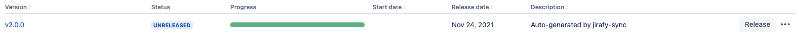
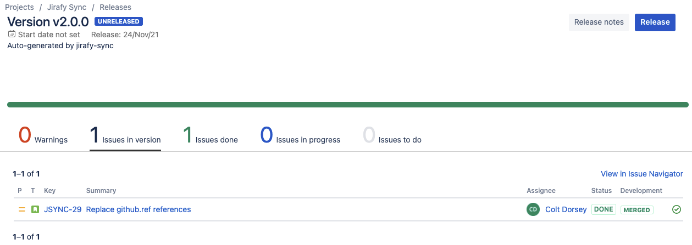
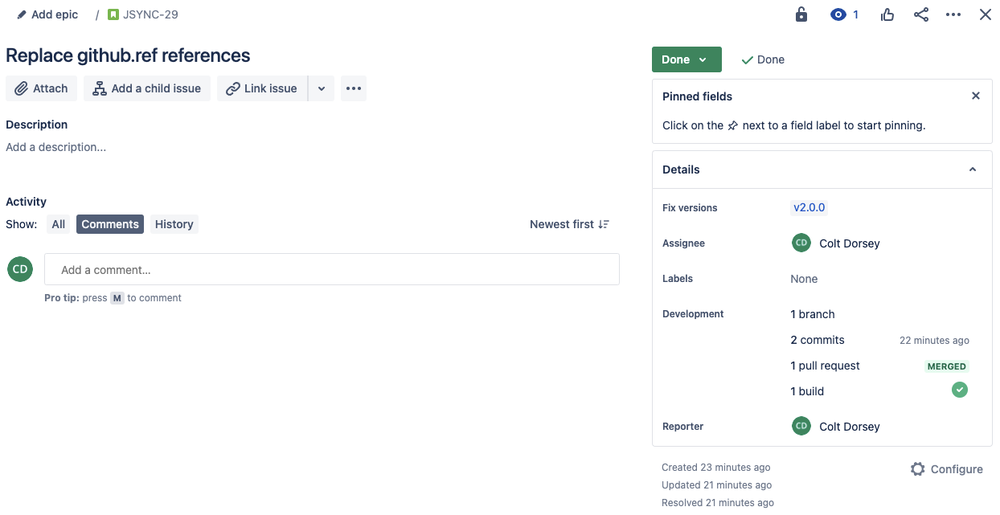

[](https://github.com/onXmaps/jirafy-sync/actions/workflows/tests.yml)
# Jirafy Sync
Sync Jira tickets and version based on a given changelog (ideally generated by [onXmaps@jirafy-changelog](https://github.com/marketplace/actions/jirafy-changelog))

## What does Jirafy Sync specifically do?
This action requires a changelog as input. If the changelog has references to Jira tickets, it will parse the changelog for Jira projects and tickets. For each project, the latest repository release will be the Jira project version created. Each Jira ticket's `fixVersions` property will be updated to the corresponding Jira version created.

### Creates Jira Version
<a href="https://github.com/onXmaps/jirafy-sync/releases/tag/v2.0.0"></a>

<a href="https://github.com/onXmaps/jirafy-sync/releases/tag/v2.0.0"></a>

### Updates Jira ticket(s) fixVersion property
<a href="https://github.com/onXmaps/jirafy-sync/releases/tag/v2.0.0"></a>

## Recommended configuration
- Jirafy Sync works best if [onXmaps/jirafy-changelog](https://github.com/onXmaps/jirafy-changelog) action generates the changelog. The changelog can be generated given there is already at least one github release in your repository.

- Next you'll need to generate a release. I recommend using [actions/actions/create-release@latest](https://github.com/actions/create-release).

- Finally you'll want to sync the github release with a jira version using [Jirafy-Sync](https://github.com/onXmaps/jirafy-sync#jirafy-sync) action. The `${{ github.ref_name }}` value is the tag that triggers the recommended workflow and should set as the input of `jiraVersion` property. The action will create the corresponding Jira project versions that don't already exist, as well as update the fix version of each ticket that was found in the given changelog.

```yaml
name: Jirafy Sync
on:
  push:
    # Sequence of patterns matched against refs/tags
    tags:
      - 'v*' # Push events to matching v*, i.e. v1.0, v1.0.0

jobs:
  release:
    runs-on: ubuntu-latest
    steps:
      # To use this repository's private action, you must check out the repository
      - name: Checkout
        uses: actions/checkout@v2

      - name: Jirafy Changelog
        id: changelog
        uses: onXmaps/jirafy-changelog@v1.1.0
        with:
          jiraHost: 'coltdorsey.atlassian.net'
          myToken: ${{ secrets.GITHUB_TOKEN }}

      - name: Create Release
        id: create_release
        uses: actions/create-release@latest
        env:
          GITHUB_TOKEN: ${{ secrets.GITHUB_TOKEN }}
        with:
          tag_name: ${{ github.ref }}
          release_name: Release ${{ github.ref }}
          body: ${{ steps.changelog.outputs.changelog }}
          draft: false
          prerelease: false

      - name: Jirafy Sync
        uses: onXmaps/jirafy-sync@v2.0.1
        with:
          changelog: ${{ steps.changelog.outputs.changelog }}
          jiraVersion: ${{ github.ref_name }}
          jiraHost: 'coltdorsey.atlassian.net'
          jiraUsername: ${{ secrets.JIRA_USERNAME }}
          jiraToken: ${{ secrets.JIRA_TOKEN }}
```

## Open Discussions for feature requests or questions

Issues are for folks who are actively using the action and running into an "issue" (bug, missing doc, etc).

Feature requests should be in the [discussion section.](https://github.com/onXmaps/jirafy-sync/discussions).
Just to set expectations the bar for a new feature getting added is going to be very high. There is a
cost to adding features in the development and maintainance of the feature. So if you want to jump in and
help develop and maintain lets discuss. If you want to fire off feature ideas, go for it. Just understand its
very likely that without someone willing to take up the task, they won't get implemented.

## Keep up-to-date with GitHub Dependabot

Since [Dependabot](https://docs.github.com/en/github/administering-a-repository/keeping-your-actions-up-to-date-with-github-dependabot)
has [native GitHub Actions support](https://docs.github.com/en/github/administering-a-repository/configuration-options-for-dependency-updates#package-ecosystem),
to enable it on your GitHub repo all you need to do is add the `.github/dependabot.yml` file:

```yaml
version: 2
updates:
  # Maintain dependencies for GitHub Actions
  - package-ecosystem: 'github-actions'
    directory: '/'
    schedule:
      interval: 'daily'
```